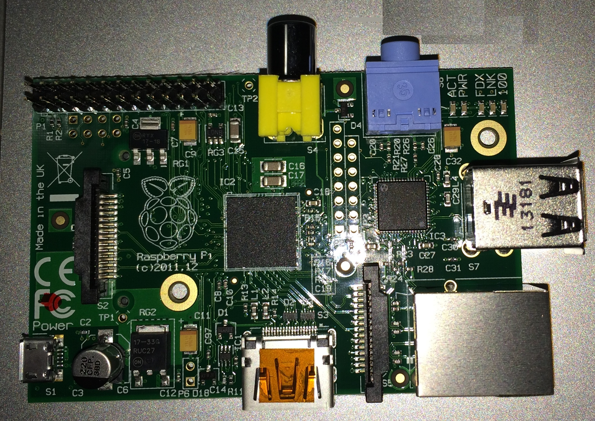

# Resalert

---

###### **NOTE:**  This readme is intended to provide step by step procedure for preparing the Resalert prototype. Information for all necessary hardware and software components is outlined. Moreso, source code along with details of required libraries is detailed to assist in assembly.

---

This repository houses the proposed IoT-enabled information-centric architecture driven approach, which is called here “Resalert”. The Resalert offers emergency IoT-enabled information supply chain architecture pattern and system architecture. Research findings suggests that a RaspberryPi based system prototype could be useful to the effective delivery of emergency information to elderly people.  

**Keywords:** E-government; Emergency Information Management; Information Architecture; Internet of Things (IoT); Smart Technology

## Hardware Components
The hardware needed for completing the setup is detailed below. The main component of the prototype is the Raspberry Pi, pictured below. This System on a Chip CPU is essentially a pocket-sized personal computer. The Pi and other needed hardware is estimated at around $60.00 AUD. Only those components used will be detailed so that an alternative build could use these as minimum system requirements. Note that the 2nd iteration of the Raspberry Pi is also appropriate for building the prototype. 

* Raspberry Pi Model B
 * 32 bit, 700 MHz System on a Chip
 * 512 MB of RAM
 * USB 2.0 ports (2) 
 * 100mb Ethernet port
 * SD Card slot
 * HDMI connector
 * microUSB power input 
 * General Purpose Input and Output (26 pin)

#### Peripherals
* HDMI enabled powered display
* USB power supply (5V, >700mA)
* Wireless Router
* SD Card (16GB)
* Separate laptop for remote access
* 1000-1500 MCD 5mm Red LED Emitters
* Pi Cobbler or compatible 16bit breakout board
* 400-point breadboard (printed circuit board)
* Push button switch
* Resistor (10kΩ) (color bands: brown, black, orange, and gold) 

#### Connectors
* Ethernet cable or USB wifi adapter
* microUSB B (Male) to USB A (Female) cable
* Jumper Wires
* Ribbon cable (26 pins) for breakout board
* Powered USB Hub (recommended 4)
* HDMI Cable

## Setup
The setup is broken down into a precedural sequence which can be followed to rebuild the initial prototype. Use the table to below to get an idea of the overall build. 

|Overview|
|---|
| 1. Preparing the Operating System for Raspberry Pi| 
| 2. Setting up the Raspberry Pi hardware| 
| 3. Setting up the break out board and components| 
| 4. Setting up software and downloading source code| 
| 5. Running and terminating the program.| 

### 1 - Prepare Operating System
The operating system of choice at the time of initial build was Raspbian v3.10. To ease installation, it is recommended to make use of NOOBS which rapidly speeds up OS configuration. It is assumed that the router is configured and accessible with an Internet connection. To initially configure the OS, it is necessary to:

1. Erase and reformat the SD card. There is freely available open source software for accomplishing this task on your existing personal computer. 
2. Copy the operating system image or NOOBS package to the root directory of the SD card. 

### 2 - Setup for the Breadboard
1. Connect the breakout board using the Pi Cobbler and ribbon cable.
2. Connect LED lights to the breadboard.
  	1. Connect pin 25 to breadboard using mare-to-female jumper wire.
  	2. Connect ground pin to negative power bus on breadboard using male-to-female jumper wire.
  	3. Connect the LED.
  		1. Anode side to the same channel as the pin 25 jumper wire.
  		2. Cathose side to ground power bus.
	4. Repease these steps connecting pin 18 to the other LED 
3. Connect the push button switch.
	1. Insert the push button switch to straddle the middle channel of the breadboard.
	2. Connect pin 24 to a top terminal for the push button.
	3. Connect positive power bus to 3v3 pin (Do not use 5V pin. This will damage the device).
	4. Connect the power bus to one of the top terminals for the push button.
	5. Using the 10K resistor, connect ground rail to the input side of the push button. 

 
### 3 - Setup for the Pi Hardware
3. Attach the core peripherals to the Raspberry Pi.
	1. Insert prepared SD card
	1. Connect HDMI display using the HDMI cable
	2. Connect the USB hub 
	3. Connect the USB keyboard and mouse via the hub
 	4. Connect the USB wifi adapter or router
5. Power on the display
6. Insert microUSB to power on the device to start the device

###  4 - Setup for Software
1. Follow the on screen setup instructions for OS setup. Ensure SSH is enabled.
2. Conigure LAN and Internet connection
3. Download and install RPi.GPIO library
4. Clone the git repo using the public link:
		
		git clone git@github.com:enphnt/resalert.git

### 5 - Run the Program
1. Run the program, either via SSH or within a terminal on the Pi, by executing the shell script: 
			
		./<absolute/path/to>/alert.sh
		
2. Use the push button to terminate the program manually. 